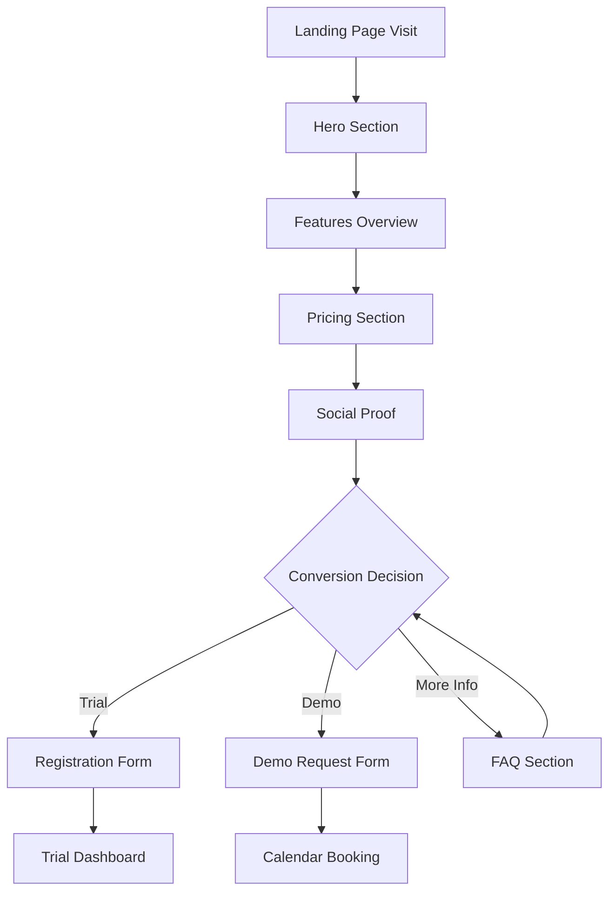

# Flipstack CRM Landing Page - Product Requirements Document

## 1. Product Overview

Flipstack CRM Landing Page is a conversion-optimized marketing website designed to showcase the platform's value proposition and drive user acquisition through strategic messaging and clear pricing presentation. The landing page serves as the primary entry point for potential customers, emphasizing the unique benefits of our real estate wholesaling CRM while providing seamless pathways to trial signup and product demonstration.

The landing page addresses the critical need for clear value communication in the competitive CRM market, targeting real estate wholesalers who require specialized tools for lead management, buyer databases, and deal tracking. The page will serve as a high-converting marketing asset that supports business growth and customer acquisition goals.

## 2. Core Features

### 2.1 User Roles

| Role | Registration Method | Core Permissions |
|------|---------------------|------------------|
| Visitor | Direct website access | Can view all content, access pricing, request demo |
| Trial User | Email registration via CTA | Can access 14-day free trial with full features |
| Demo Requestor | Contact form submission | Can schedule personalized product demonstration |

### 2.2 Feature Module

Our landing page requirements consist of the following main sections:

1. **Hero Section**: Primary value proposition, headline messaging, and main call-to-action
2. **Features Overview**: Key platform capabilities and benefits presentation
3. **Pricing Section**: Three-tier pricing structure with feature comparisons
4. **Social Proof**: Customer testimonials, success stories, and trust indicators
5. **Demo Request**: Interactive demo scheduling and contact forms
6. **Footer**: Navigation links, legal information, and additional resources

### 2.3 Page Details

| Page Name | Module Name | Feature description |
|-----------|-------------|---------------------|
| Landing Page | Hero Section | Display compelling headline, subheadline, and primary CTA button. Include hero image/video showcasing platform interface. Implement animated elements for engagement. |
| Landing Page | Value Proposition | Present three key benefits with icons and descriptions. Highlight unique selling points for real estate wholesalers. Include statistics and performance metrics. |
| Landing Page | Features Overview | Showcase 6-8 core platform features with visual representations. Include lead management, buyer database, deal tracking, and analytics capabilities. Use interactive elements or hover effects. |
| Landing Page | Pricing Tiers | Display Basic ($49/month), Professional ($99/month), and Enterprise (Custom) plans. Include feature comparison matrix with checkmarks and restrictions. Implement pricing toggle for monthly/annual billing. |
| Landing Page | Social Proof | Display customer testimonials with photos and company names. Include success metrics, case studies, and trust badges. Show customer logos and ratings. |
| Landing Page | Demo Section | Provide demo request form with calendar integration. Include "Watch Demo Video" option. Implement lead capture with progressive profiling. |
| Landing Page | FAQ Section | Address common questions about features, pricing, and implementation. Use expandable accordion format. Include search functionality for questions. |
| Landing Page | Footer | Include navigation links, legal pages, contact information, and social media links. Add newsletter signup and resource downloads. |

## 3. Core Process

### Visitor Flow
The primary user journey begins with visitors arriving from various marketing channels (search, social media, referrals). They immediately encounter the hero section with clear value proposition, then scroll through features and benefits. The pricing section provides transparent cost information, while social proof builds trust and credibility. Multiple conversion points guide users toward trial signup or demo requests.

### Trial Signup Flow
Users interested in trying the platform click the primary CTA, complete a streamlined registration form, and gain immediate access to a 14-day trial with full features. The onboarding process includes guided tours and sample data to demonstrate value quickly.

### Demo Request Flow
Enterprise prospects or users requiring personalized demonstrations can request a demo through dedicated forms, which integrate with calendar scheduling systems for seamless booking of sales consultations.

## 4. User Interface Design

### 4.1 Design Style

**Primary Colors:**
- Primary Blue: #2563EB (trust, professionalism)
- Secondary Orange: #EA580C (energy, action)
- Success Green: #16A34A (growth, success)
- Neutral Gray: #6B7280 (balance, sophistication)

**Button Styles:**
- Primary CTA: Rounded corners (8px), gradient background, hover animations
- Secondary CTA: Outlined style with hover fill effects
- Tertiary: Text-based with underline animations

**Typography:**
- Headlines: Inter Bold, 48px-72px for hero, 32px-48px for sections
- Body Text: Inter Regular, 16px-18px with 1.6 line height
- Captions: Inter Medium, 14px for supporting text

**Layout Style:**
- Clean, modern design with ample white space
- Card-based components with subtle shadows
- Sticky navigation header with smooth scrolling
- Mobile-first responsive grid system

**Animation & Interactions:**
- Subtle fade-in animations on scroll
- Hover effects on interactive elements
- Smooth transitions between sections
- Loading animations for form submissions

### 4.2 Page Design Overview

| Page Name | Module Name | UI Elements |
|-----------|-------------|-------------|
| Landing Page | Hero Section | Full-width background with gradient overlay, centered content layout, large headline typography, dual CTA buttons with contrasting styles, animated dashboard mockup or video |
| Landing Page | Features Grid | 3-column responsive grid on desktop, 1-column on mobile, feature cards with icons, hover animations, and brief descriptions, consistent spacing and alignment |
| Landing Page | Pricing Cards | 3-column pricing table with highlighted "Popular" option, feature comparison checkmarks, pricing toggle switch, gradient borders for premium tiers |
| Landing Page | Testimonials | Carousel or grid layout with customer photos, quote styling with large quotation marks, company logos, star ratings, and navigation controls |
| Landing Page | Demo Section | Split layout with form on left, benefits list on right, calendar integration widget, video thumbnail with play button overlay |
| Landing Page | Footer | Multi-column layout with organized link groups, newsletter signup form, social media icons, legal links, and company information |

### 4.3 Responsiveness

The landing page follows a mobile-first design approach with breakpoints at 640px (mobile), 768px (tablet), 1024px (desktop), and 1280px (large desktop). Touch interactions are optimized for mobile devices with appropriate button sizes (minimum 44px) and gesture-friendly navigation. The design adapts seamlessly across all device types while maintaining visual hierarchy and conversion optimization.

**Mobile Optimizations:**
- Simplified navigation with hamburger menu
- Stacked pricing cards for easy comparison
- Touch-friendly form inputs and buttons
- Optimized images and lazy loading
- Reduced animation complexity for performance

**Desktop Enhancements:**
- Multi-column layouts for efficient space usage
- Hover effects and micro-interactions
- Larger hero sections with more visual impact
- Side-by-side content arrangements
- Enhanced typography hierarchy