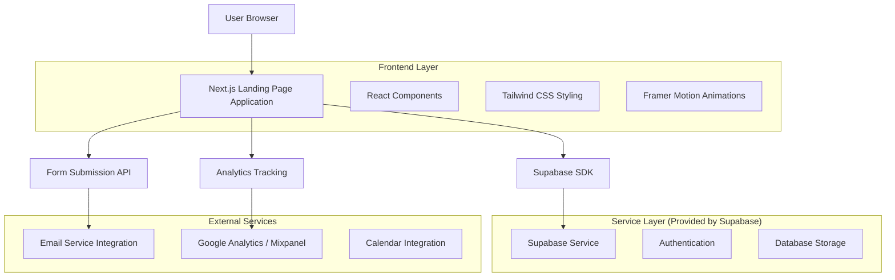
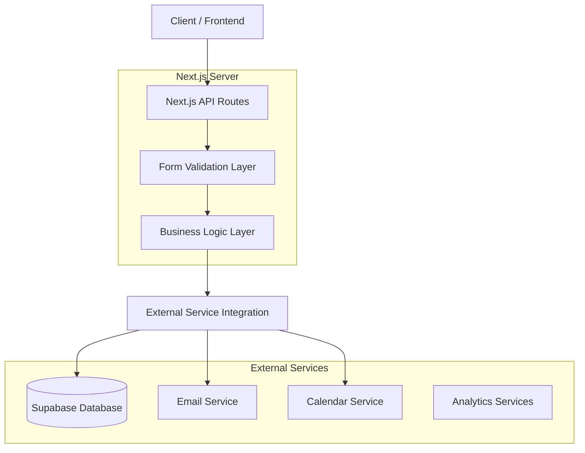
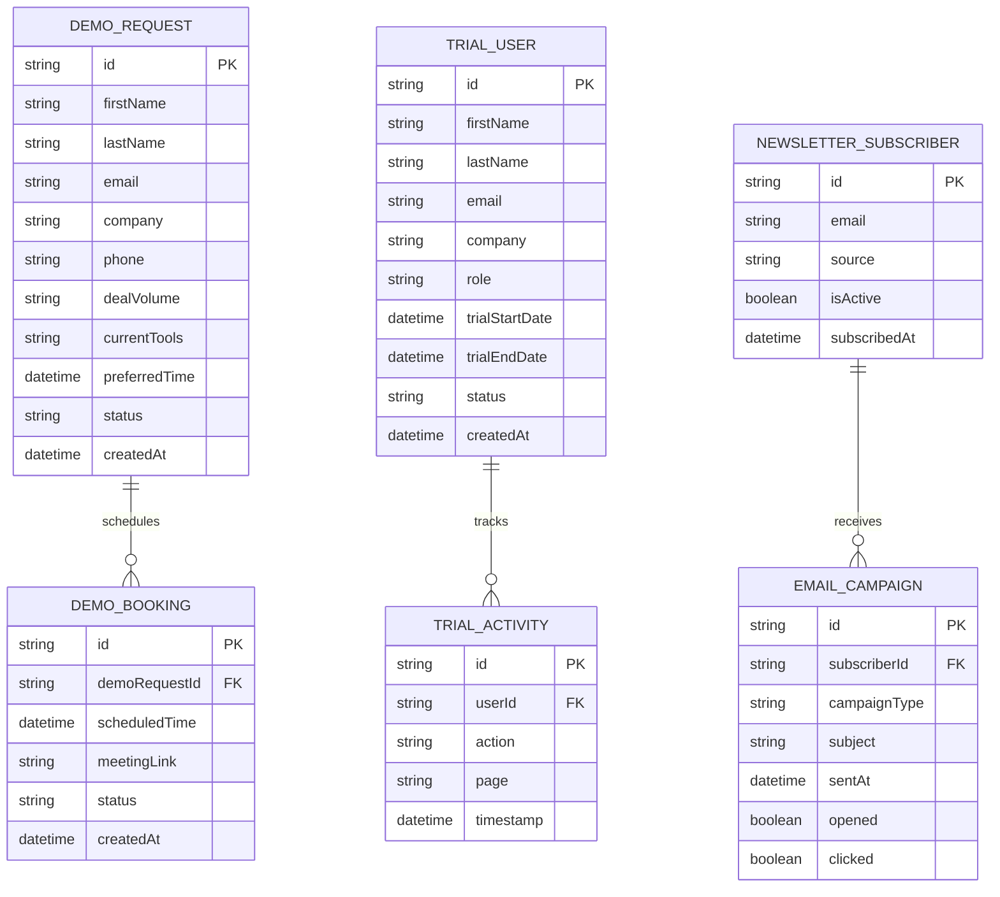

# Flipstack CRM Landing Page - Technical Architecture Document

## 1. Architecture Design



## 2. Technology Description

- Frontend: React@19 + Next.js@15 + TypeScript + Tailwind CSS@4 + Framer Motion
- Backend: Supabase (Authentication, Database, Real-time subscriptions)
- Analytics: Google Analytics 4 + Mixpanel for conversion tracking
- Email Service: Resend or SendGrid for transactional emails
- Calendar: Cal.com or Calendly integration for demo scheduling

## 3. Route Definitions

| Route | Purpose |
|-------|---------|
| / | Main landing page with hero, features, pricing, and social proof |
| /pricing | Dedicated pricing page with detailed feature comparisons |
| /demo | Demo request page with calendar integration and form |
| /signup | Trial registration page with streamlined onboarding |
| /login | User authentication for existing customers |
| /thank-you | Conversion confirmation page for form submissions |
| /privacy | Privacy policy and data handling information |
| /terms | Terms of service and usage agreements |

## 4. API Definitions

### 4.1 Core API

**Demo Request Submission**
```
POST /api/demo-request
```

Request:
| Param Name | Param Type | isRequired | Description |
|------------|------------|------------|-------------|
| firstName | string | true | Contact's first name |
| lastName | string | true | Contact's last name |
| email | string | true | Contact's email address |
| company | string | true | Company or organization name |
| phone | string | false | Contact phone number |
| dealVolume | string | true | Monthly deal volume range |
| currentTools | string | false | Current CRM or tools being used |
| preferredTime | string | false | Preferred demo time slot |

Response:
| Param Name | Param Type | Description |
|------------|------------|-------------|
| success | boolean | Request submission status |
| message | string | Confirmation or error message |
| demoId | string | Unique demo request identifier |

Example Request:
```json
{
  "firstName": "John",
  "lastName": "Smith",
  "email": "john@example.com",
  "company": "Smith Real Estate",
  "phone": "+1-555-0123",
  "dealVolume": "10-25 deals/month",
  "currentTools": "Spreadsheets, basic CRM",
  "preferredTime": "2024-01-15T14:00:00Z"
}
```

**Trial Signup**
```
POST /api/trial-signup
```

Request:
| Param Name | Param Type | isRequired | Description |
|------------|------------|------------|-------------|
| firstName | string | true | User's first name |
| lastName | string | true | User's last name |
| email | string | true | User's email address |
| password | string | true | Account password |
| company | string | true | Company name |
| role | string | true | User role (wholesaler, investor, agent) |

Response:
| Param Name | Param Type | Description |
|------------|------------|-------------|
| success | boolean | Signup status |
| userId | string | Created user identifier |
| trialEndDate | string | Trial expiration date |

**Newsletter Subscription**
```
POST /api/newsletter-subscribe
```

Request:
| Param Name | Param Type | isRequired | Description |
|------------|------------|------------|-------------|
| email | string | true | Subscriber email address |
| source | string | false | Subscription source (footer, popup, etc.) |

Response:
| Param Name | Param Type | Description |
|------------|------------|-------------|
| success | boolean | Subscription status |
| message | string | Confirmation message |

## 5. Server Architecture Diagram



## 6. Data Model

### 6.1 Data Model Definition



### 6.2 Data Definition Language

**Demo Request Table (demo_requests)**
```sql
-- Create table
CREATE TABLE demo_requests (
    id UUID PRIMARY KEY DEFAULT gen_random_uuid(),
    first_name VARCHAR(100) NOT NULL,
    last_name VARCHAR(100) NOT NULL,
    email VARCHAR(255) NOT NULL,
    company VARCHAR(200) NOT NULL,
    phone VARCHAR(20),
    deal_volume VARCHAR(50) NOT NULL,
    current_tools TEXT,
    preferred_time TIMESTAMP WITH TIME ZONE,
    status VARCHAR(20) DEFAULT 'pending' CHECK (status IN ('pending', 'scheduled', 'completed', 'cancelled')),
    created_at TIMESTAMP WITH TIME ZONE DEFAULT NOW(),
    updated_at TIMESTAMP WITH TIME ZONE DEFAULT NOW()
);

-- Create indexes
CREATE INDEX idx_demo_requests_email ON demo_requests(email);
CREATE INDEX idx_demo_requests_status ON demo_requests(status);
CREATE INDEX idx_demo_requests_created_at ON demo_requests(created_at DESC);

-- Grant permissions
GRANT SELECT, INSERT, UPDATE ON demo_requests TO authenticated;
GRANT SELECT ON demo_requests TO anon;
```

**Trial Users Table (trial_users)**
```sql
-- Create table
CREATE TABLE trial_users (
    id UUID PRIMARY KEY DEFAULT gen_random_uuid(),
    first_name VARCHAR(100) NOT NULL,
    last_name VARCHAR(100) NOT NULL,
    email VARCHAR(255) UNIQUE NOT NULL,
    company VARCHAR(200) NOT NULL,
    role VARCHAR(50) NOT NULL CHECK (role IN ('wholesaler', 'investor', 'agent', 'other')),
    trial_start_date TIMESTAMP WITH TIME ZONE DEFAULT NOW(),
    trial_end_date TIMESTAMP WITH TIME ZONE DEFAULT (NOW() + INTERVAL '14 days'),
    status VARCHAR(20) DEFAULT 'active' CHECK (status IN ('active', 'expired', 'converted', 'cancelled')),
    created_at TIMESTAMP WITH TIME ZONE DEFAULT NOW(),
    updated_at TIMESTAMP WITH TIME ZONE DEFAULT NOW()
);

-- Create indexes
CREATE INDEX idx_trial_users_email ON trial_users(email);
CREATE INDEX idx_trial_users_status ON trial_users(status);
CREATE INDEX idx_trial_users_trial_end_date ON trial_users(trial_end_date);

-- Grant permissions
GRANT ALL PRIVILEGES ON trial_users TO authenticated;
GRANT SELECT ON trial_users TO anon;
```

**Newsletter Subscribers Table (newsletter_subscribers)**
```sql
-- Create table
CREATE TABLE newsletter_subscribers (
    id UUID PRIMARY KEY DEFAULT gen_random_uuid(),
    email VARCHAR(255) UNIQUE NOT NULL,
    source VARCHAR(50) DEFAULT 'website',
    is_active BOOLEAN DEFAULT true,
    subscribed_at TIMESTAMP WITH TIME ZONE DEFAULT NOW(),
    unsubscribed_at TIMESTAMP WITH TIME ZONE,
    created_at TIMESTAMP WITH TIME ZONE DEFAULT NOW()
);

-- Create indexes
CREATE INDEX idx_newsletter_subscribers_email ON newsletter_subscribers(email);
CREATE INDEX idx_newsletter_subscribers_active ON newsletter_subscribers(is_active);
CREATE INDEX idx_newsletter_subscribers_subscribed_at ON newsletter_subscribers(subscribed_at DESC);

-- Grant permissions
GRANT SELECT, INSERT, UPDATE ON newsletter_subscribers TO authenticated;
GRANT INSERT ON newsletter_subscribers TO anon;
```

**Landing Page Analytics Table (landing_page_analytics)**
```sql
-- Create table
CREATE TABLE landing_page_analytics (
    id UUID PRIMARY KEY DEFAULT gen_random_uuid(),
    session_id VARCHAR(100),
    page_path VARCHAR(200) NOT NULL,
    action VARCHAR(100) NOT NULL,
    element VARCHAR(100),
    user_agent TEXT,
    ip_address INET,
    referrer VARCHAR(500),
    utm_source VARCHAR(100),
    utm_medium VARCHAR(100),
    utm_campaign VARCHAR(100),
    created_at TIMESTAMP WITH TIME ZONE DEFAULT NOW()
);

-- Create indexes
CREATE INDEX idx_landing_analytics_session ON landing_page_analytics(session_id);
CREATE INDEX idx_landing_analytics_action ON landing_page_analytics(action);
CREATE INDEX idx_landing_analytics_created_at ON landing_page_analytics(created_at DESC);
CREATE INDEX idx_landing_analytics_utm_source ON landing_page_analytics(utm_source);

-- Grant permissions
GRANT SELECT, INSERT ON landing_page_analytics TO authenticated;
GRANT INSERT ON landing_page_analytics TO anon;
```

**Initial Data**
```sql
-- Insert sample demo request statuses for reference
INSERT INTO demo_requests (first_name, last_name, email, company, deal_volume, status) VALUES
('John', 'Demo', 'demo@example.com', 'Demo Company', '5-10 deals/month', 'completed');

-- Insert sample newsletter subscriber
INSERT INTO newsletter_subscribers (email, source) VALUES
('newsletter@example.com', 'footer_signup');
```