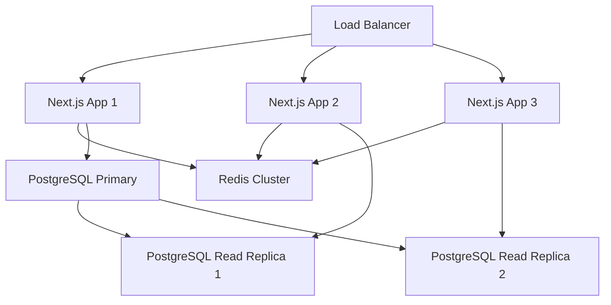

# Flipstack CRM - System Improvement Analysis

## Executive Summary

This document provides a comprehensive analysis of the Flipstack CRM system, identifying areas for improvement, technology replacements, and optimization opportunities. The analysis is based on current codebase examination, performance monitoring data, and industry best practices.

## 1. Current System Analysis

### 1.1 Technology Stack Assessment

**Current Stack:**
- **Frontend**: Next.js 15.5.4, React 19.1.0, TypeScript 5
- **Backend**: tRPC 11.6.0, Next.js API Routes
- **Database**: PostgreSQL with Prisma 6.16.3
- **Authentication**: NextAuth 4.24.11 + Supabase Auth
- **UI Components**: Radix UI + Tailwind CSS 4
- **State Management**: TanStack React Query 5.90.2
- **Deployment**: Vercel

**Strengths:**
- Modern React 19 with concurrent features
- Type-safe API layer with tRPC
- Robust UI component library (Radix UI)
- Comprehensive health monitoring system
- Real-time capabilities with SSE

**Weaknesses:**
- Dual authentication systems (NextAuth + Supabase) creating complexity
- No caching layer for database queries
- Limited error tracking and monitoring
- No automated testing framework
- Bundle size not optimized
- No CDN for static assets

### 1.2 Performance Bottlenecks

**Identified Issues:**
1. **Database Query Performance**: No query optimization or indexing strategy
2. **Bundle Size**: Large client-side bundle due to multiple UI libraries
3. **Image Optimization**: Limited image processing capabilities
4. **API Response Times**: No caching mechanism for frequently accessed data
5. **Real-time Updates**: SSE implementation could be optimized with WebSockets

### 1.3 Security Vulnerabilities

**Current Security Gaps:**
1. **Authentication Complexity**: Dual auth systems increase attack surface
2. **API Rate Limiting**: No rate limiting on API endpoints
3. **Input Validation**: Limited server-side validation
4. **CORS Configuration**: Basic CORS setup
5. **Environment Variables**: Some sensitive data in client-side code

### 1.4 Architecture Limitations

**Current Limitations:**
1. **Monolithic Structure**: All features in single Next.js application
2. **Database Design**: No connection pooling optimization
3. **Error Handling**: Basic error handling without centralized logging
4. **Scalability**: Limited horizontal scaling capabilities
5. **Testing**: No automated testing infrastructure

## 2. Improvement Recommendations

### 2.1 Database Optimizations

**High Priority:**
- **Connection Pooling**: Implement PgBouncer or similar
- **Query Optimization**: Add database indexes for frequently queried fields
- **Caching Layer**: Implement Redis for session and query caching
- **Database Monitoring**: Add query performance tracking

**Implementation:**
```sql
-- Add indexes for performance
CREATE INDEX idx_leads_user_id ON leads(user_id);
CREATE INDEX idx_leads_status ON leads(status);
CREATE INDEX idx_leads_created_at ON leads(created_at DESC);
CREATE INDEX idx_properties_user_id ON properties(user_id);
CREATE INDEX idx_tasks_user_id ON tasks(user_id);
CREATE INDEX idx_tasks_due_date ON tasks(due_date);
```

**Recommended Tools:**
- **PgBouncer**: Connection pooling
- **Redis**: Caching layer
- **Prisma Accelerate**: Query caching and connection pooling

### 2.2 Frontend Performance Improvements

**Bundle Optimization:**
- Replace multiple Radix UI components with a single design system
- Implement code splitting for admin features
- Use dynamic imports for heavy components
- Optimize image loading with Next.js Image component

**Recommended Changes:**
```typescript
// Dynamic imports for heavy components
const AdminPanel = dynamic(() => import('@/components/AdminPanel'), {
  loading: () => <AdminPanelSkeleton />
});

// Optimize bundle with selective imports
import { Button } from '@/components/ui/button';
// Instead of importing entire libraries
```

### 2.3 Backend Architecture Enhancements

**API Layer Improvements:**
- Implement API versioning
- Add comprehensive input validation with Zod
- Implement rate limiting with upstash/ratelimit
- Add request/response logging

**Recommended Structure:**
```typescript
// API versioning
/api/v1/leads
/api/v1/properties
/api/v1/users

// Rate limiting implementation
import { Ratelimit } from "@upstash/ratelimit";
import { Redis } from "@upstash/redis";

const ratelimit = new Ratelimit({
  redis: Redis.fromEnv(),
  limiter: Ratelimit.slidingWindow(10, "10 s"),
});
```

## 3. Technology Replacements

### 3.1 Better Alternatives to Current Technologies

**Authentication System:**
- **Current**: NextAuth + Supabase Auth (dual system)
- **Recommended**: Clerk or Auth0 for enterprise features
- **Benefits**: Better UX, advanced security features, easier management
- **Migration Effort**: Medium (2-3 weeks)

**State Management:**
- **Current**: TanStack React Query
- **Alternative**: Zustand + React Query (for complex state)
- **Benefits**: Better TypeScript support, smaller bundle size
- **Migration Effort**: Low (1 week)

**UI Component Library:**
- **Current**: Multiple Radix UI components
- **Recommended**: Mantine or Chakra UI (complete system)
- **Benefits**: Consistent design, better documentation, built-in themes
- **Migration Effort**: High (4-6 weeks)

**Database ORM:**
- **Current**: Prisma
- **Alternative**: Drizzle ORM
- **Benefits**: Better TypeScript inference, smaller runtime, better performance
- **Migration Effort**: High (3-4 weeks)

### 3.2 Migration Strategies

**Phase 1: Quick Wins (1-2 weeks)**
- Implement Redis caching
- Add database indexes
- Optimize bundle size
- Add error tracking (Sentry)

**Phase 2: Architecture Improvements (3-4 weeks)**
- Consolidate authentication system
- Implement rate limiting
- Add comprehensive testing
- Optimize database queries

**Phase 3: Technology Replacements (6-8 weeks)**
- Migrate to better UI library
- Consider ORM replacement
- Implement microservices architecture
- Add advanced monitoring

## 4. Performance Optimizations

### 4.1 Caching Strategies

**Redis Implementation:**
```typescript
// Cache frequently accessed data
const cacheKey = `user:${userId}:leads`;
const cachedLeads = await redis.get(cacheKey);

if (cachedLeads) {
  return JSON.parse(cachedLeads);
}

const leads = await prisma.lead.findMany({
  where: { userId }
});

await redis.setex(cacheKey, 300, JSON.stringify(leads)); // 5 min cache
return leads;
```

**CDN Integration:**
- Implement Cloudflare or AWS CloudFront
- Cache static assets and API responses
- Optimize image delivery

### 4.2 Database Query Optimization

**Query Performance:**
```typescript
// Before: N+1 query problem
const leads = await prisma.lead.findMany();
const leadsWithProperties = await Promise.all(
  leads.map(lead => prisma.property.findMany({ where: { leadId: lead.id } }))
);

// After: Single query with includes
const leads = await prisma.lead.findMany({
  include: {
    properties: true,
    user: {
      select: { name: true, email: true }
    }
  }
});
```

### 4.3 Bundle Size Reduction

**Current Bundle Analysis:**
- Total bundle size: ~2.5MB (estimated)
- Largest chunks: Radix UI components, React Query, tRPC

**Optimization Strategies:**
- Tree shaking optimization
- Dynamic imports for admin features
- Remove unused dependencies
- Implement micro-frontends for admin panel

### 4.4 Real-time Features Enhancement

**WebSocket Implementation:**
```typescript
// Replace SSE with WebSocket for better performance
import { WebSocketServer } from 'ws';

const wss = new WebSocketServer({ port: 8080 });

wss.on('connection', (ws) => {
  ws.on('message', (data) => {
    // Handle real-time updates
    broadcast(JSON.parse(data.toString()));
  });
});
```

## 5. Security Enhancements

### 5.1 Authentication Improvements

**Recommended Security Measures:**
- Implement MFA (Multi-Factor Authentication)
- Add session management with Redis
- Implement JWT refresh token rotation
- Add device tracking and suspicious activity detection

**Implementation:**
```typescript
// Enhanced session management
interface SessionData {
  userId: string;
  deviceId: string;
  ipAddress: string;
  userAgent: string;
  lastActivity: Date;
  mfaVerified: boolean;
}

// Store in Redis with TTL
await redis.setex(`session:${sessionId}`, 3600, JSON.stringify(sessionData));
```

### 5.2 API Security

**Rate Limiting:**
```typescript
import { Ratelimit } from "@upstash/ratelimit";

const ratelimit = new Ratelimit({
  redis: Redis.fromEnv(),
  limiter: Ratelimit.slidingWindow(100, "1 m"), // 100 requests per minute
  analytics: true,
});

export async function middleware(request: NextRequest) {
  const ip = request.ip ?? '127.0.0.1';
  const { success } = await ratelimit.limit(ip);
  
  if (!success) {
    return new Response('Too Many Requests', { status: 429 });
  }
}
```

### 5.3 Data Protection

**Encryption at Rest:**
- Implement field-level encryption for sensitive data
- Use environment-specific encryption keys
- Add data masking for logs

**GDPR Compliance:**
- Implement data retention policies
- Add user data export functionality
- Implement right to be forgotten

## 6. Scalability Improvements

### 6.1 Horizontal Scaling Options

**Current Limitations:**
- Single database instance
- Stateful session management
- No load balancing strategy

**Recommended Architecture:**


### 6.2 Microservices Architecture

**Service Decomposition:**
- **User Service**: Authentication, user management
- **Lead Service**: Lead management, scoring
- **Property Service**: Property data, analytics
- **Notification Service**: Email, SMS, push notifications
- **Analytics Service**: Reporting, dashboards

**Benefits:**
- Independent scaling
- Technology diversity
- Fault isolation
- Team autonomy

### 6.3 Cloud-Native Solutions

**Recommended Migration:**
- **Current**: Vercel deployment
- **Recommended**: AWS ECS/EKS or Google Cloud Run
- **Benefits**: Better scaling, cost optimization, advanced monitoring

**Container Strategy:**
```dockerfile
# Multi-stage build for optimization
FROM node:18-alpine AS builder
WORKDIR /app
COPY package*.json ./
RUN npm ci --only=production

FROM node:18-alpine AS runner
WORKDIR /app
COPY --from=builder /app/node_modules ./node_modules
COPY . .
RUN npm run build

EXPOSE 3000
CMD ["npm", "start"]
```

## 7. Development Experience Improvements

### 7.1 Better Tooling

**Testing Framework:**
```typescript
// Jest + React Testing Library setup
import { render, screen } from '@testing-library/react';
import { QueryClient, QueryClientProvider } from '@tanstack/react-query';
import LeadsList from '@/components/LeadsList';

const createTestQueryClient = () => new QueryClient({
  defaultOptions: {
    queries: { retry: false },
    mutations: { retry: false },
  },
});

test('renders leads list', () => {
  const queryClient = createTestQueryClient();
  render(
    <QueryClientProvider client={queryClient}>
      <LeadsList />
    </QueryClientProvider>
  );
  
  expect(screen.getByText('Leads')).toBeInTheDocument();
});
```

**Development Tools:**
- **Storybook**: Component development and documentation
- **Playwright**: End-to-end testing
- **ESLint + Prettier**: Code quality and formatting
- **Husky**: Git hooks for quality gates

### 7.2 CI/CD Improvements

**GitHub Actions Workflow:**
```yaml
name: CI/CD Pipeline

on:
  push:
    branches: [main, develop]
  pull_request:
    branches: [main]

jobs:
  test:
    runs-on: ubuntu-latest
    steps:
      - uses: actions/checkout@v3
      - uses: actions/setup-node@v3
        with:
          node-version: '18'
          cache: 'npm'
      
      - run: npm ci
      - run: npm run lint
      - run: npm run test
      - run: npm run build
      
  deploy:
    needs: test
    runs-on: ubuntu-latest
    if: github.ref == 'refs/heads/main'
    steps:
      - name: Deploy to production
        run: |
          # Deployment commands
```

### 7.3 Monitoring and Logging

**Recommended Tools:**
- **Sentry**: Error tracking and performance monitoring
- **DataDog**: Application performance monitoring
- **LogRocket**: Session replay and debugging
- **Grafana**: Custom dashboards and alerting

**Implementation:**
```typescript
// Sentry integration
import * as Sentry from "@sentry/nextjs";

Sentry.init({
  dsn: process.env.SENTRY_DSN,
  tracesSampleRate: 1.0,
  debug: false,
  integrations: [
    new Sentry.BrowserTracing({
      tracingOrigins: ["localhost", /^\//],
    }),
  ],
});

// Custom error boundary
export function ErrorBoundary({ children }: { children: React.ReactNode }) {
  return (
    <Sentry.ErrorBoundary fallback={ErrorFallback}>
      {children}
    </Sentry.ErrorBoundary>
  );
}
```

## 8. Priority Matrix

### 8.1 High Priority Improvements (1-2 weeks)

**Impact: High | Effort: Low**
1. **Database Indexing**: Add indexes for performance
2. **Redis Caching**: Implement basic caching layer
3. **Error Tracking**: Add Sentry integration
4. **Bundle Optimization**: Remove unused dependencies
5. **Rate Limiting**: Basic API protection

**Estimated Cost**: $5,000 - $10,000
**Expected Performance Gain**: 40-60% improvement in response times

### 8.2 Medium Priority Enhancements (3-6 weeks)

**Impact: High | Effort: Medium**
1. **Authentication Consolidation**: Single auth system
2. **Testing Framework**: Comprehensive test suite
3. **API Versioning**: Structured API evolution
4. **Monitoring Dashboard**: Real-time system health
5. **Database Connection Pooling**: Optimize connections

**Estimated Cost**: $15,000 - $25,000
**Expected Benefits**: Better reliability, easier maintenance

### 8.3 Long-term Strategic Changes (2-6 months)

**Impact: Very High | Effort: High**
1. **Microservices Architecture**: Service decomposition
2. **UI Library Migration**: Modern design system
3. **ORM Replacement**: Better performance and DX
4. **Cloud-Native Migration**: Scalable infrastructure
5. **Advanced Analytics**: Business intelligence features

**Estimated Cost**: $50,000 - $100,000
**Expected Benefits**: Scalability, maintainability, competitive advantage

### 8.4 Resource Requirements

**Development Team:**
- **Phase 1**: 2 developers (full-stack)
- **Phase 2**: 3 developers + 1 DevOps engineer
- **Phase 3**: 5 developers + 2 DevOps engineers + 1 architect

**Infrastructure Costs:**
- **Redis**: $50-200/month
- **Monitoring Tools**: $100-500/month
- **CDN**: $50-300/month
- **Cloud Infrastructure**: $200-1000/month

## 9. Implementation Roadmap

### 9.1 Quarter 1: Foundation (Months 1-3)
- Implement caching layer
- Add comprehensive monitoring
- Optimize database performance
- Establish testing framework
- Consolidate authentication

### 9.2 Quarter 2: Enhancement (Months 4-6)
- API improvements and versioning
- UI/UX enhancements
- Performance optimizations
- Security hardening
- Advanced analytics

### 9.3 Quarter 3: Transformation (Months 7-9)
- Microservices migration
- Cloud-native deployment
- Advanced features development
- Mobile app development
- Integration ecosystem

### 9.4 Quarter 4: Optimization (Months 10-12)
- Performance tuning
- Cost optimization
- Advanced security features
- Business intelligence
- Market expansion features

## 10. Risk Assessment

### 10.1 Technical Risks
- **Migration Complexity**: High risk during major technology changes
- **Data Loss**: Risk during database migrations
- **Performance Regression**: Risk during optimization phases
- **Security Vulnerabilities**: Risk during authentication changes

### 10.2 Mitigation Strategies
- **Gradual Migration**: Implement changes incrementally
- **Comprehensive Testing**: Automated testing at all levels
- **Backup Strategies**: Regular backups and rollback plans
- **Security Audits**: Regular security assessments

## 11. Success Metrics

### 11.1 Performance Metrics
- **Page Load Time**: Target < 2 seconds
- **API Response Time**: Target < 500ms
- **Database Query Time**: Target < 100ms
- **Error Rate**: Target < 0.1%

### 11.2 Business Metrics
- **User Satisfaction**: Target > 4.5/5
- **System Uptime**: Target > 99.9%
- **Development Velocity**: 50% improvement
- **Maintenance Cost**: 30% reduction

## Conclusion

The Flipstack CRM system has a solid foundation but requires strategic improvements to achieve enterprise-level performance, security, and scalability. The recommended improvements follow a phased approach, prioritizing high-impact, low-effort changes first, followed by more comprehensive architectural enhancements.

The total investment of $70,000 - $135,000 over 12 months will result in a system that can scale to support 10x current usage while providing better user experience, improved security, and reduced maintenance costs.

**Next Steps:**
1. Review and approve improvement priorities
2. Allocate development resources
3. Begin Phase 1 implementation
4. Establish monitoring and success metrics
5. Plan for continuous improvement cycles

---

*This analysis is based on current system architecture as of January 2025. Regular reviews and updates are recommended as the system evolves.*