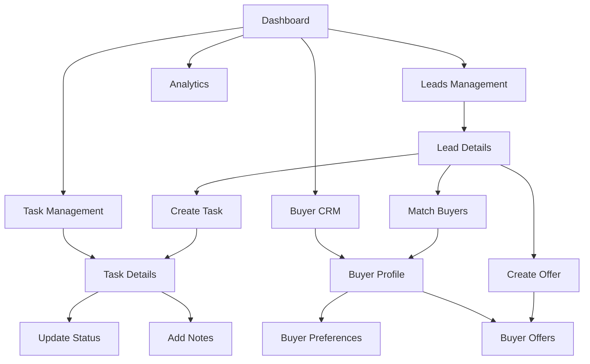
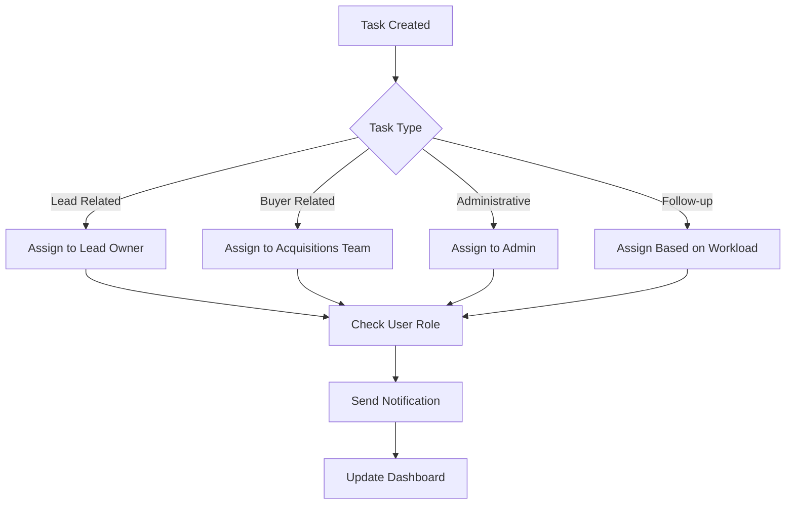
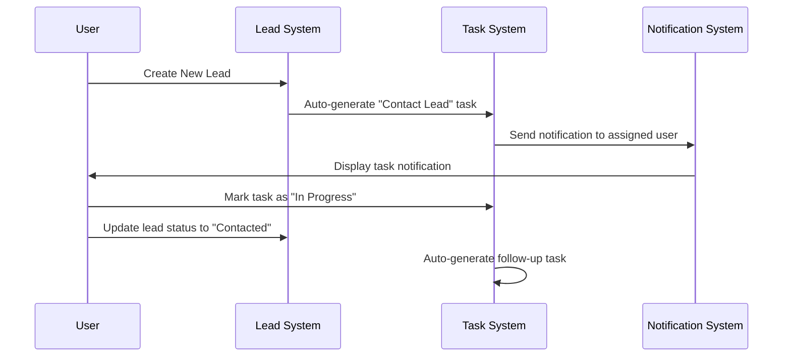
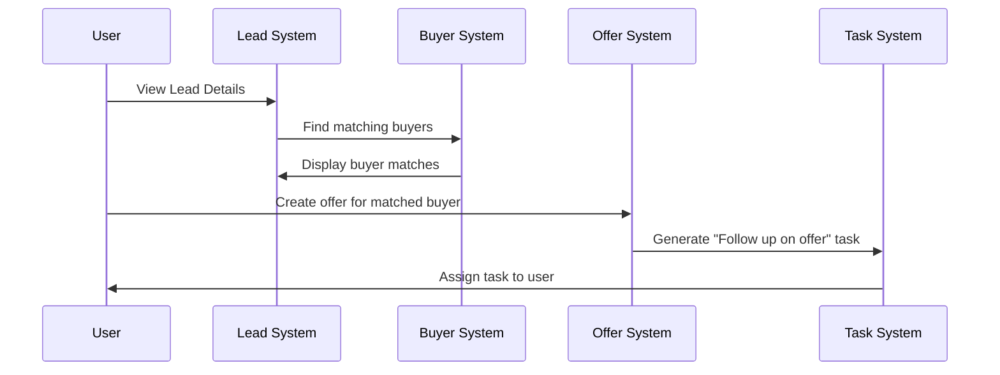
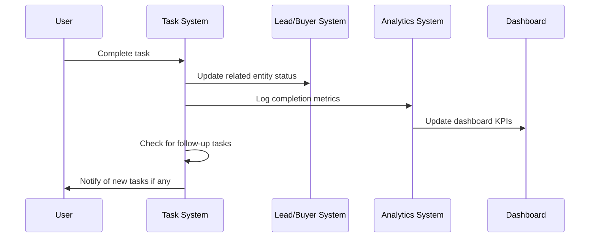
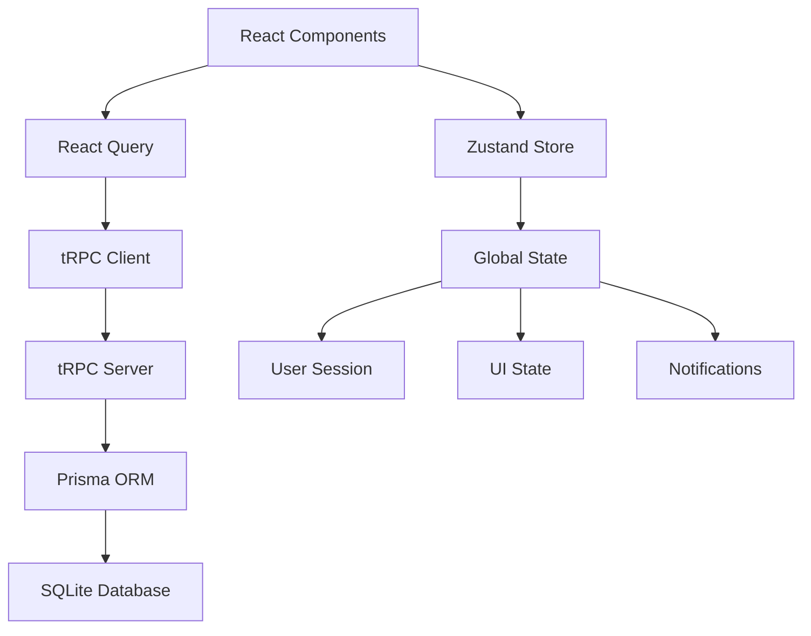

# Flipstackk 3.0 - Live Data Integration & Workflow Plan

## 1. Live Data Integration Workflow

### 1.1 Dashboard Real-Time Metrics
**Key Performance Indicators (KPIs):**
- **Lead Metrics:** Total leads, new leads today, conversion rate, pipeline value
- **Buyer Metrics:** Active buyers, cash buyers percentage, average proof of funds
- **Task Metrics:** Pending tasks, overdue tasks, completion rate, team productivity
- **Offer Metrics:** Active offers, acceptance rate, average offer amount
- **Revenue Metrics:** Monthly revenue, deals closed, average deal size

**Real-Time Updates:**
- WebSocket connections for instant data updates
- Auto-refresh every 30 seconds for critical metrics
- Push notifications for urgent tasks and new leads
- Live activity feed showing recent actions across the system

### 1.2 Cross-Page Data Flow


## 2. Task Management System Integration

### 2.1 Automated Task Generation
**Lead-Based Tasks:**
- **New Lead:** "Contact lead within 1 hour" (High Priority)
- **Qualified Lead:** "Schedule property visit" (Medium Priority)
- **Under Contract:** "Prepare closing documents" (High Priority)
- **Follow-up:** "Follow up with lead in 3 days" (Low Priority)

**Buyer-Based Tasks:**
- **New Buyer:** "Verify proof of funds" (High Priority)
- **Active Buyer:** "Send matching properties weekly" (Medium Priority)
- **Offer Submitted:** "Follow up on offer status" (High Priority)

**System-Based Tasks:**
- **Overdue Follow-ups:** Auto-generated for missed contacts
- **Document Expiry:** Remind about expiring contracts/offers
- **Performance Reviews:** Monthly team performance tasks

### 2.2 Task Assignment Logic


### 2.3 Task Workflow States
1. **Created** → Auto-assigned based on rules
2. **Assigned** → User receives notification
3. **In Progress** → User starts working on task
4. **Pending Review** → Requires supervisor approval
5. **Completed** → Task finished, metrics updated
6. **Cancelled** → Task no longer needed

## 3. Page Interconnectivity Plan

### 3.1 Navigation Flow
**Primary Navigation:**
- Dashboard (Home) - Overview of all activities
- Leads - Lead management and pipeline
- Buyers - Buyer CRM and preferences
- Tasks - Task management and calendar
- Analytics - Reports and performance metrics
- Settings - User and system configuration

**Secondary Navigation:**
- Quick Actions Bar (Create Lead, Add Buyer, New Task)
- Search Global (Search across all entities)
- Notifications Panel (Real-time alerts)
- User Profile Menu (Account settings, logout)

### 3.2 Cross-Reference Features
**From Lead Pages:**
- "Create Task" button → Task creation with lead context
- "Match Buyers" section → Direct link to matching buyers
- "Create Offer" button → Offer creation with lead/buyer context
- "View History" → Timeline of all related activities

**From Buyer Pages:**
- "Matching Leads" section → Show compatible properties
- "Create Offer" button → Offer creation with buyer context
- "Schedule Meeting" → Create task for buyer meeting
- "Update Preferences" → Modify buying criteria

**From Task Pages:**
- "Related Lead/Buyer" links → Direct navigation to entities
- "Create Follow-up" → Generate subsequent tasks
- "Update Status" → Real-time status changes
- "Add Notes" → Activity logging

### 3.3 Quick Access Features
- **Global Search:** Search leads, buyers, tasks from any page
- **Quick Create:** Floating action button for rapid data entry
- **Recent Items:** Recently viewed leads/buyers/tasks
- **Favorites:** Bookmark important items for quick access

## 4. Feature Implementation Roadmap

### Phase 1: Task Management System (Week 1-2)
**Core Features:**
- Task CRUD operations with tRPC API
- Task assignment and status management
- Calendar view with due dates
- Task notifications and alerts
- Integration with existing Lead/Buyer systems

**Pages to Create:**
- `/tasks` - Task list and management
- `/tasks/new` - Create new task
- `/tasks/[id]` - Task details and updates
- `/tasks/calendar` - Calendar view of tasks

### Phase 2: Live Dashboard with Analytics (Week 3-4)
**Dashboard Enhancements:**
- Real-time KPI widgets
- Interactive charts and graphs
- Activity timeline
- Performance metrics
- Quick action buttons

**Analytics Features:**
- Lead conversion funnel
- Buyer engagement metrics
- Task completion analytics
- Revenue tracking
- Team performance reports

### Phase 3: Cross-Page Integration (Week 5-6)
**Integration Features:**
- Buyer matching on lead pages
- Task creation from any context
- Cross-entity navigation
- Global search functionality
- Activity logging across all pages

**Workflow Automation:**
- Automated task generation
- Status-based notifications
- Follow-up reminders
- Document expiry alerts

### Phase 4: Advanced Features (Week 7-8)
**Advanced Functionality:**
- Real-time notifications
- Email integration
- Document management
- Advanced reporting
- Mobile responsiveness optimization

## 5. User Workflow Scenarios

### 5.1 Lead Intake to Task Assignment


### 5.2 Buyer Matching to Offer Creation


### 5.3 Task Completion Workflow


## 6. Technical Architecture

### 6.1 Real-Time Data Synchronization
**Technology Stack:**
- **Frontend:** React Query for caching and synchronization
- **Backend:** tRPC with WebSocket support for real-time updates
- **Database:** SQLite with optimized queries for performance
- **State Management:** Zustand for global state management

**Update Mechanisms:**
- **Optimistic Updates:** Immediate UI updates with rollback on failure
- **Background Sync:** Periodic data synchronization every 30 seconds
- **Event-Driven Updates:** Real-time updates for critical actions
- **Conflict Resolution:** Last-write-wins with user notification

### 6.2 API Optimization
**Performance Strategies:**
- **Data Pagination:** Limit large datasets with cursor-based pagination
- **Selective Loading:** Load only required fields for list views
- **Caching Strategy:** Cache frequently accessed data with TTL
- **Batch Operations:** Group multiple operations for efficiency

**Query Optimization:**
```typescript
// Example optimized queries
const getDashboardData = async () => {
  return await prisma.$transaction([
    prisma.lead.count({ where: { status: 'NEW' } }),
    prisma.buyer.count({ where: { cashBuyer: true } }),
    prisma.task.count({ where: { status: 'PENDING' } }),
    prisma.offer.count({ where: { status: 'SENT' } })
  ]);
};
```

### 6.3 State Management Architecture


## 7. Implementation Priority Matrix

### High Priority (Immediate)
1. **Task Management System** - Core functionality for workflow management
2. **Dashboard Live Data** - Real-time metrics and KPIs
3. **Cross-Page Navigation** - Seamless user experience
4. **Basic Notifications** - Task assignments and updates

### Medium Priority (Next Phase)
1. **Advanced Analytics** - Detailed reporting and insights
2. **Workflow Automation** - Automated task generation
3. **Global Search** - Search across all entities
4. **Activity Logging** - Comprehensive audit trail

### Low Priority (Future Enhancement)
1. **Email Integration** - Automated email notifications
2. **Document Management** - File upload and storage
3. **Mobile App** - Native mobile application
4. **Advanced Reporting** - Custom report builder

## 8. Success Metrics

### User Experience Metrics
- **Page Load Time:** < 2 seconds for all pages
- **Task Completion Rate:** > 90% of assigned tasks completed
- **User Engagement:** Average session time > 15 minutes
- **Error Rate:** < 1% of user actions result in errors

### Business Metrics
- **Lead Conversion Rate:** Track improvement in lead-to-deal conversion
- **Response Time:** Average time to contact new leads
- **Deal Velocity:** Time from lead to closed deal
- **Team Productivity:** Tasks completed per user per day

### Technical Metrics
- **API Response Time:** < 500ms for 95% of requests
- **Database Query Performance:** < 100ms for complex queries
- **Real-time Update Latency:** < 1 second for live updates
- **System Uptime:** > 99.9% availability

This comprehensive workflow plan provides a clear roadmap for implementing live data integration and task management in Flipstackk 3.0, ensuring all features work together seamlessly to create an efficient real estate wholesaling CRM system.