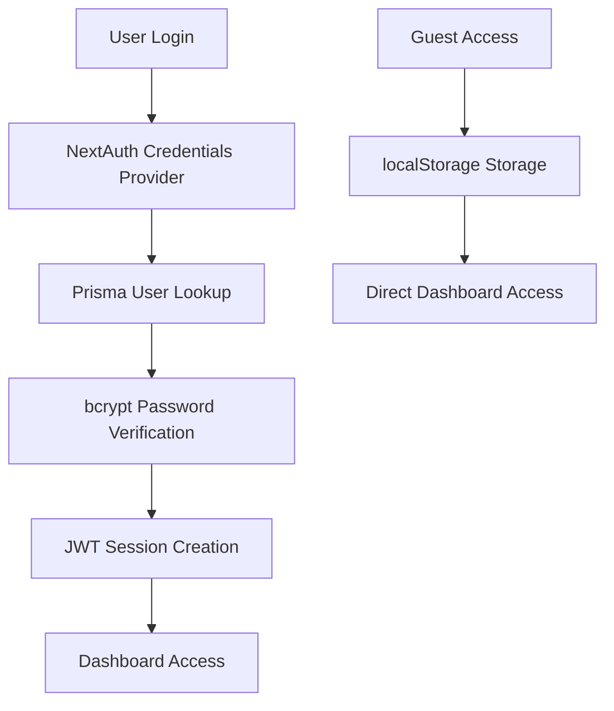
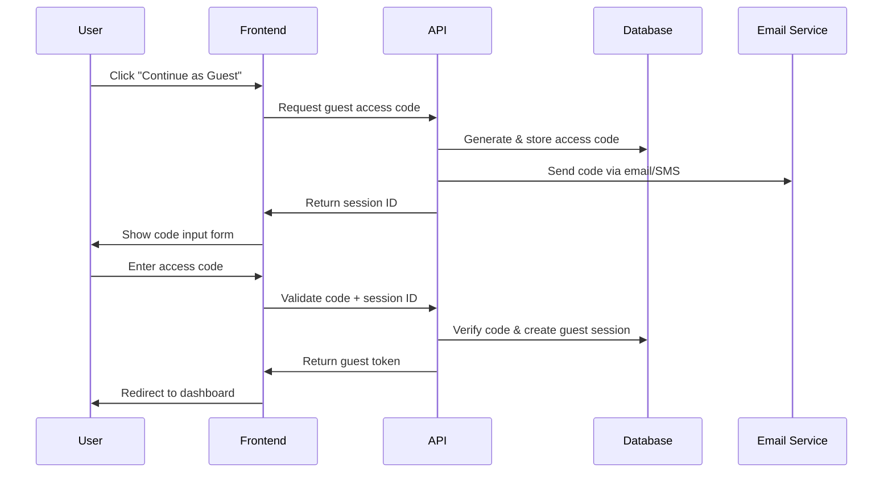

# Secure Guest Access System with 2FA Implementation Plan
## Flipstack CRM - Technical Architecture & Implementation Strategy

---

## 1. Current System Analysis

### 1.1 Technology Stack Overview
- **Frontend**: Next.js 15.5.4 with React 19.1.0, TypeScript
- **Authentication**: NextAuth v4.24.11 with Credentials Provider
- **Database**: PostgreSQL with Prisma ORM v6.16.3
- **Backend Services**: Supabase v2.76.1 (managed PostgreSQL + additional services)
- **API Layer**: tRPC v11.6.0 for type-safe API calls
- **UI Components**: Radix UI with Tailwind CSS v4
- **State Management**: TanStack React Query v5.90.2
- **Security**: bcryptjs for password hashing, JWT sessions

### 1.2 Current Authentication Architecture


**Current Issues with Guest Access:**
- Simple localStorage-based implementation
- No security validation or time limits
- No audit trail or monitoring
- Vulnerable to unauthorized access

### 1.3 Database Schema Analysis
Current User model supports:
- Standard user roles (ADMIN, AGENT, ACQUISITIONS)
- Password-based authentication
- Basic user metadata

**Missing for Guest Access:**
- Guest session tracking
- Access code management
- Trial system integration
- Temporary access controls

---

## 2. Proposed Secure Guest Access System

### 2.1 Two-Factor Authentication Flow



### 2.2 Security Architecture

#### Access Code Generation
- **Algorithm**: Cryptographically secure random 6-digit codes
- **Entropy**: 1,000,000 possible combinations
- **Expiration**: 10 minutes from generation
- **Rate Limiting**: Max 3 attempts per IP per hour
- **Storage**: Hashed codes in database with salt

#### Session Management
- **Duration**: 2-hour guest sessions (configurable)
- **Refresh**: No automatic refresh for security
- **Tracking**: Full audit log of guest activities
- **Isolation**: Limited dashboard access with read-only permissions

---

## 3. Database Schema Extensions

### 3.1 New Tables Required

```sql
-- Guest Access Sessions
CREATE TABLE "GuestSession" (
  "id" TEXT PRIMARY KEY DEFAULT gen_random_uuid(),
  "sessionToken" TEXT UNIQUE NOT NULL,
  "accessCode" TEXT NOT NULL, -- Hashed
  "email" TEXT,
  "phone" TEXT,
  "ipAddress" TEXT NOT NULL,
  "userAgent" TEXT,
  "status" TEXT NOT NULL DEFAULT 'PENDING', -- PENDING, ACTIVE, EXPIRED, REVOKED
  "expiresAt" TIMESTAMP NOT NULL,
  "codeExpiresAt" TIMESTAMP NOT NULL,
  "attempts" INTEGER DEFAULT 0,
  "maxAttempts" INTEGER DEFAULT 3,
  "createdAt" TIMESTAMP DEFAULT NOW(),
  "lastAccessAt" TIMESTAMP,
  "trialId" TEXT REFERENCES "Trial"("id"),
  "demoId" TEXT REFERENCES "Demo"("id")
);

-- Trial System
CREATE TABLE "Trial" (
  "id" TEXT PRIMARY KEY DEFAULT gen_random_uuid(),
  "email" TEXT UNIQUE NOT NULL,
  "firstName" TEXT NOT NULL,
  "lastName" TEXT NOT NULL,
  "phone" TEXT,
  "company" TEXT,
  "paymentIntentId" TEXT, -- Stripe payment intent
  "paymentStatus" TEXT DEFAULT 'PENDING', -- PENDING, PAID, FAILED, REFUNDED
  "amount" DECIMAL(10,2) DEFAULT 1.00,
  "currency" TEXT DEFAULT 'USD',
  "status" TEXT DEFAULT 'ACTIVE', -- ACTIVE, EXPIRED, CONVERTED, CANCELLED
  "startDate" TIMESTAMP DEFAULT NOW(),
  "endDate" TIMESTAMP NOT NULL,
  "convertedAt" TIMESTAMP,
  "createdAt" TIMESTAMP DEFAULT NOW(),
  "updatedAt" TIMESTAMP DEFAULT NOW()
);

-- Demo Scheduling
CREATE TABLE "Demo" (
  "id" TEXT PRIMARY KEY DEFAULT gen_random_uuid(),
  "trialId" TEXT REFERENCES "Trial"("id"),
  "scheduledAt" TIMESTAMP NOT NULL,
  "duration" INTEGER DEFAULT 60, -- minutes
  "attendeeEmail" TEXT NOT NULL,
  "attendeeName" TEXT NOT NULL,
  "attendeePhone" TEXT,
  "meetingLink" TEXT,
  "status" TEXT DEFAULT 'SCHEDULED', -- SCHEDULED, COMPLETED, CANCELLED, NO_SHOW
  "notes" TEXT,
  "createdAt" TIMESTAMP DEFAULT NOW(),
  "updatedAt" TIMESTAMP DEFAULT NOW()
);

-- Access Audit Log
CREATE TABLE "GuestAccessLog" (
  "id" TEXT PRIMARY KEY DEFAULT gen_random_uuid(),
  "sessionId" TEXT REFERENCES "GuestSession"("id"),
  "action" TEXT NOT NULL,
  "resource" TEXT,
  "ipAddress" TEXT,
  "userAgent" TEXT,
  "timestamp" TIMESTAMP DEFAULT NOW(),
  "metadata" JSONB
);
```

### 3.2 Indexes for Performance
```sql
CREATE INDEX idx_guest_session_token ON "GuestSession"("sessionToken");
CREATE INDEX idx_guest_session_status ON "GuestSession"("status");
CREATE INDEX idx_guest_session_expires ON "GuestSession"("expiresAt");
CREATE INDEX idx_trial_email ON "Trial"("email");
CREATE INDEX idx_trial_status ON "Trial"("status");
CREATE INDEX idx_demo_scheduled ON "Demo"("scheduledAt");
CREATE INDEX idx_access_log_session ON "GuestAccessLog"("sessionId");
```

---

## 4. API Implementation

### 4.1 tRPC Procedures

```typescript
// src/server/routers/guest.ts
export const guestRouter = router({
  // Request guest access code
  requestAccess: publicProcedure
    .input(z.object({
      email: z.string().email().optional(),
      phone: z.string().optional(),
    }))
    .mutation(async ({ input, ctx }) => {
      // Generate secure access code
      // Store in database with expiration
      // Send via email/SMS
      // Return session ID
    }),

  // Validate access code
  validateCode: publicProcedure
    .input(z.object({
      sessionId: z.string(),
      code: z.string().length(6),
    }))
    .mutation(async ({ input, ctx }) => {
      // Verify code and session
      // Create guest session token
      // Return authentication token
    }),

  // Get guest session info
  getSession: guestProcedure
    .query(async ({ ctx }) => {
      // Return current guest session details
    }),

  // Extend guest session (if allowed)
  extendSession: guestProcedure
    .mutation(async ({ ctx }) => {
      // Extend session by 1 hour (max 2 extensions)
    }),
});
```

### 4.2 Trial System Procedures

```typescript
// src/server/routers/trial.ts
export const trialRouter = router({
  // Start $1 trial
  startTrial: publicProcedure
    .input(z.object({
      email: z.string().email(),
      firstName: z.string(),
      lastName: z.string(),
      phone: z.string().optional(),
      company: z.string().optional(),
    }))
    .mutation(async ({ input, ctx }) => {
      // Create Stripe payment intent
      // Create trial record
      // Send confirmation email
    }),

  // Schedule demo
  scheduleDemo: publicProcedure
    .input(z.object({
      trialId: z.string(),
      scheduledAt: z.date(),
      attendeeName: z.string(),
      attendeeEmail: z.string().email(),
      attendeePhone: z.string().optional(),
    }))
    .mutation(async ({ input, ctx }) => {
      // Create demo record
      // Generate calendar invite
      // Send confirmation
    }),

  // Get trial status
  getTrialStatus: publicProcedure
    .input(z.object({
      email: z.string().email(),
    }))
    .query(async ({ input, ctx }) => {
      // Return trial information
    }),
});
```

---

## 5. Frontend Implementation

### 5.1 Guest Access Flow Components

```typescript
// src/components/auth/GuestAccessModal.tsx
interface GuestAccessModalProps {
  isOpen: boolean;
  onClose: () => void;
}

export function GuestAccessModal({ isOpen, onClose }: GuestAccessModalProps) {
  const [step, setStep] = useState<'request' | 'verify'>('request');
  const [sessionId, setSessionId] = useState<string>('');
  
  // Component implementation with form validation
  // Email/phone input for code delivery
  // Code verification form
  // Loading states and error handling
}
```

```typescript
// src/components/trial/TrialSignupForm.tsx
export function TrialSignupForm() {
  // $1 trial signup form
  // Stripe payment integration
  // Demo scheduling interface
  // Success confirmation
}
```

### 5.2 Protected Route Middleware

```typescript
// src/middleware.ts - Enhanced
export function middleware(request: NextRequest) {
  const { pathname } = request.nextUrl;
  
  // Check for guest session token
  const guestToken = request.cookies.get('guest-session-token');
  
  if (pathname.startsWith('/dashboard')) {
    // Verify guest session or regular auth
    if (guestToken) {
      return validateGuestSession(guestToken, request);
    }
    
    // Existing auth validation
    return validateRegularAuth(request);
  }
  
  return NextResponse.next();
}
```

---

## 6. Security Implementation

### 6.1 Rate Limiting Strategy

```typescript
// src/lib/rate-limiter.ts
export class RateLimiter {
  private static attempts = new Map<string, number[]>();
  
  static checkGuestAccessAttempts(ip: string): boolean {
    const now = Date.now();
    const windowMs = 60 * 60 * 1000; // 1 hour
    const maxAttempts = 3;
    
    const attempts = this.attempts.get(ip) || [];
    const recentAttempts = attempts.filter(time => now - time < windowMs);
    
    if (recentAttempts.length >= maxAttempts) {
      return false; // Rate limited
    }
    
    recentAttempts.push(now);
    this.attempts.set(ip, recentAttempts);
    return true;
  }
}
```

### 6.2 Access Code Security

```typescript
// src/lib/access-codes.ts
export class AccessCodeManager {
  static generateCode(): string {
    // Cryptographically secure 6-digit code
    const array = new Uint32Array(1);
    crypto.getRandomValues(array);
    return (array[0] % 1000000).toString().padStart(6, '0');
  }
  
  static async hashCode(code: string): Promise<string> {
    const salt = await bcrypt.genSalt(12);
    return bcrypt.hash(code, salt);
  }
  
  static async verifyCode(code: string, hash: string): Promise<boolean> {
    return bcrypt.compare(code, hash);
  }
}
```

### 6.3 Guest Session Permissions

```typescript
// src/lib/permissions.ts
export const GUEST_PERMISSIONS = {
  dashboard: {
    read: true,
    write: false,
  },
  leads: {
    read: true, // Limited to sample data
    write: false,
  },
  properties: {
    read: true, // Limited to sample data
    write: false,
  },
  reports: {
    read: false, // No access to sensitive data
    write: false,
  },
  settings: {
    read: false,
    write: false,
  },
} as const;
```

---

## 7. Integration Points

### 7.1 Payment Processing (Stripe)

```typescript
// src/lib/stripe.ts
export async function createTrialPaymentIntent(
  email: string,
  amount: number = 100 // $1.00 in cents
) {
  const paymentIntent = await stripe.paymentIntents.create({
    amount,
    currency: 'usd',
    customer_email: email,
    metadata: {
      type: 'trial',
      email,
    },
  });
  
  return paymentIntent;
}
```

### 7.2 Email/SMS Notifications

```typescript
// src/lib/notifications.ts
export async function sendGuestAccessCode(
  email: string,
  code: string,
  expiresIn: number
) {
  // Email service integration (SendGrid, AWS SES, etc.)
  const emailContent = {
    to: email,
    subject: 'Your Flipstack CRM Access Code',
    template: 'guest-access-code',
    data: {
      code,
      expiresIn: `${expiresIn} minutes`,
    },
  };
  
  return sendEmail(emailContent);
}
```

### 7.3 Calendar Integration

```typescript
// src/lib/calendar.ts
export async function createDemoEvent(demo: Demo) {
  // Google Calendar or Calendly integration
  const event = {
    summary: 'Flipstack CRM Demo',
    start: demo.scheduledAt,
    duration: demo.duration,
    attendees: [demo.attendeeEmail],
    description: 'Personal demo of Flipstack CRM features',
  };
  
  return createCalendarEvent(event);
}
```

---

## 8. Open Source Considerations

### 8.1 Configuration Options

```typescript
// src/config/guest-access.ts
export interface GuestAccessConfig {
  enabled: boolean;
  codeLength: number;
  codeExpirationMinutes: number;
  sessionDurationHours: number;
  maxAttemptsPerHour: number;
  emailProvider: 'sendgrid' | 'ses' | 'smtp' | 'console';
  smsProvider: 'twilio' | 'aws-sns' | 'disabled';
  paymentProvider: 'stripe' | 'disabled';
  demoScheduling: 'calendly' | 'google-calendar' | 'disabled';
}

export const defaultGuestAccessConfig: GuestAccessConfig = {
  enabled: true,
  codeLength: 6,
  codeExpirationMinutes: 10,
  sessionDurationHours: 2,
  maxAttemptsPerHour: 3,
  emailProvider: 'console', // For development
  smsProvider: 'disabled',
  paymentProvider: 'disabled', // For open source
  demoScheduling: 'disabled',
};
```

### 8.2 Environment Variables

```bash
# Guest Access Configuration
GUEST_ACCESS_ENABLED=true
GUEST_SESSION_DURATION_HOURS=2
GUEST_CODE_EXPIRATION_MINUTES=10

# Email Configuration
EMAIL_PROVIDER=sendgrid
SENDGRID_API_KEY=your_key_here

# SMS Configuration (Optional)
SMS_PROVIDER=twilio
TWILIO_ACCOUNT_SID=your_sid
TWILIO_AUTH_TOKEN=your_token

# Payment Configuration (Optional)
STRIPE_SECRET_KEY=your_stripe_key
STRIPE_WEBHOOK_SECRET=your_webhook_secret

# Demo Scheduling (Optional)
CALENDLY_API_KEY=your_calendly_key
GOOGLE_CALENDAR_CREDENTIALS=your_credentials
```

---

## 9. Testing Strategy

### 9.1 Security Testing

```typescript
// tests/security/guest-access.test.ts
describe('Guest Access Security', () => {
  test('should rate limit access code requests', async () => {
    // Test rate limiting functionality
  });
  
  test('should expire access codes after timeout', async () => {
    // Test code expiration
  });
  
  test('should prevent brute force attacks', async () => {
    // Test attempt limiting
  });
  
  test('should isolate guest sessions', async () => {
    // Test permission boundaries
  });
});
```

### 9.2 Integration Testing

```typescript
// tests/integration/trial-flow.test.ts
describe('Trial System Integration', () => {
  test('should complete full trial signup flow', async () => {
    // Test end-to-end trial process
  });
  
  test('should schedule demo successfully', async () => {
    // Test demo scheduling
  });
  
  test('should grant guest access to demo attendees', async () => {
    // Test demo-to-guest-access flow
  });
});
```

---

## 10. Implementation Timeline

### Phase 1: Core Infrastructure (Week 1-2)
- [ ] Database schema implementation
- [ ] Basic tRPC procedures
- [ ] Access code generation and validation
- [ ] Guest session management

### Phase 2: Security & UI (Week 3-4)
- [ ] Rate limiting implementation
- [ ] Frontend components
- [ ] Guest access flow
- [ ] Permission system

### Phase 3: Trial Integration (Week 5-6)
- [ ] Payment processing
- [ ] Demo scheduling
- [ ] Email notifications
- [ ] Calendar integration

### Phase 4: Testing & Documentation (Week 7-8)
- [ ] Comprehensive testing
- [ ] Security audit
- [ ] Documentation
- [ ] Open source preparation

---

## 11. Monitoring & Analytics

### 11.1 Key Metrics
- Guest access request rate
- Code validation success rate
- Session duration and activity
- Trial conversion rates
- Demo attendance rates
- Security incident detection

### 11.2 Audit Logging
- All guest access attempts
- Code generation and validation
- Session creation and expiration
- Permission violations
- Rate limiting triggers

---

## 12. Deployment Considerations

### 12.1 Production Checklist
- [ ] Environment variables configured
- [ ] Database migrations applied
- [ ] Email service configured
- [ ] Payment processing tested
- [ ] Rate limiting enabled
- [ ] Monitoring dashboards setup
- [ ] Security scanning completed

### 12.2 Scaling Considerations
- Redis for session storage in multi-instance deployments
- Database connection pooling
- CDN for static assets
- Load balancer configuration
- Auto-scaling policies

---

This comprehensive plan provides a secure, scalable foundation for implementing guest access with 2FA while maintaining the open-source nature of the Flipstack CRM system. The modular design allows for gradual implementation and easy customization for different deployment scenarios.