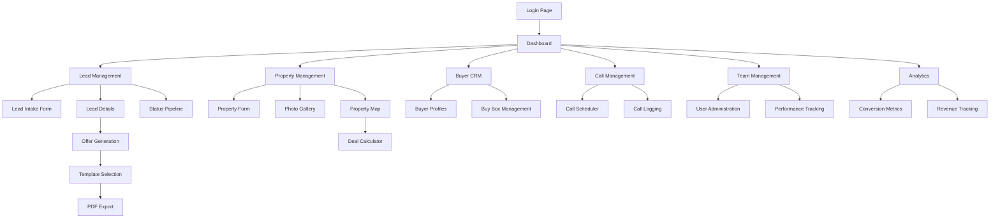

# Flipstackk 3.0 - Product Requirements Document

## 1. Product Overview

Flipstackk 3.0 is a comprehensive real estate wholesaling CRM designed to streamline deal management from lead intake to closing. The platform centralizes deal information, automates lead processes, and provides powerful tools for offer generation and buyer management within an intuitive, user-friendly interface.

The system addresses critical pain points in real estate wholesaling including disjointed workflows, lack of data centralization, inefficient lead management, and poor buyer relationship management. By providing a unified platform, Flipstackk 3.0 enables wholesalers to increase lead conversion rates, reduce deal cycle times, and improve overall team efficiency across the United States market.

## 2. Core Features

### 2.1 User Roles

| Role | Registration Method | Core Permissions |
|------|---------------------|------------------|
| Admin | System-created account | Full system access, user management, system configuration, all CRUD operations |
| Acquisitions Manager | Admin invitation with role assignment | Lead creation/editing, property management, offer generation, buyer assignment |
| Caller | Admin invitation with role assignment | Lead viewing, call logging, basic lead updates, task management |
| Investor | Admin invitation with role assignment | Read-only access to assigned deals, offer viewing, buyer profile management |

### 2.2 Feature Module

Our real estate wholesaling CRM consists of the following main pages:

1. **Dashboard**: KPI overview cards, recent activity feed, quick action buttons, performance metrics
2. **Lead Management**: Lead intake form, status pipeline board, lead details view, communication history
3. **Property Management**: Property details form, condition assessment, valuation tools, photo gallery
4. **Buyer CRM**: Buyer profiles, buy box preferences, proof of funds tracking, communication logs
5. **Offer Generation**: Template-based offer creation, e-signature integration, PDF export, tracking system
6. **Call Management**: Call scheduling, call logging, follow-up reminders, call outcome tracking
7. **Team Management**: User role assignment, performance tracking, task delegation, activity monitoring
8. **Property Map**: Interactive map view, property clustering, area analysis, market insights
9. **Deal Calculator**: ROI analysis, repair cost estimation, profit margin calculation, scenario modeling
10. **Analytics Dashboard**: Conversion metrics, pipeline analysis, team performance, revenue tracking
11. **Task Management**: Task creation, assignment, priority setting, deadline tracking, completion status
12. **Settings**: User preferences, system configuration, notification settings, integration management

### 2.3 Page Details

| Page Name | Module Name | Feature Description |
|-----------|-------------|---------------------|
| Dashboard | KPI Cards | Display key metrics: total leads, conversion rate, average deal value, monthly revenue |
| Dashboard | Activity Feed | Show recent lead updates, completed tasks, new offers, team activities in chronological order |
| Dashboard | Quick Actions | Provide one-click access to create new lead, schedule call, generate offer, add buyer |
| Lead Management | Lead Intake Form | Capture owner information, property details, timeline, motivation, asking price with validation |
| Lead Management | Status Pipeline | Visual kanban board with drag-drop functionality for lead stages: New → Contacted → Qualified → Offer Sent → Under Contract → Assigned → Closed |
| Lead Management | Lead Details | Comprehensive lead view with property info, communication history, tasks, offers, notes |
| Lead Management | Communication Log | Track all interactions including calls, emails, texts with timestamps and outcomes |
| Property Management | Property Form | Input address, type, condition, bedrooms, bathrooms, square footage, estimated value |
| Property Management | Photo Gallery | Upload and manage property photos with categorization and annotation capabilities |
| Property Management | Valuation Tools | Integrate with market data APIs for automated property valuation and comparable analysis |
| Buyer CRM | Buyer Profiles | Store buyer information, contact details, company info, proof of funds, buying preferences |
| Buyer CRM | Buy Box Management | Define buyer criteria including price range, property types, preferred areas, cash requirements |
| Buyer CRM | Buyer Matching | Automatically match properties to buyers based on buy box criteria and preferences |
| Offer Generation | Template System | Pre-built offer templates with customizable terms, conditions, and legal language |
| Offer Generation | E-signature Integration | Send offers for electronic signature with tracking and reminder capabilities |
| Offer Generation | PDF Export | Generate professional PDF offers with company branding and legal compliance |
| Call Management | Call Scheduler | Calendar integration for scheduling calls with leads, buyers, and team members |
| Call Management | Call Logging | Record call outcomes, notes, next steps, and follow-up requirements |
| Call Management | Follow-up System | Automated reminders for scheduled follow-ups with customizable intervals |
| Team Management | User Administration | Create, edit, delete user accounts with role-based permissions and access control |
| Team Management | Performance Tracking | Monitor individual and team metrics including calls made, leads converted, deals closed |
| Team Management | Task Assignment | Delegate tasks to team members with priority levels, due dates, and progress tracking |
| Property Map | Interactive Map | Display properties on map with clustering, filtering, and detailed property popups |
| Property Map | Area Analysis | Analyze market trends, property density, and investment opportunities by geographic area |
| Deal Calculator | ROI Calculator | Calculate return on investment with repair costs, holding costs, and profit margins |
| Deal Calculator | Scenario Modeling | Compare different deal structures and financing options with what-if analysis |
| Analytics Dashboard | Conversion Metrics | Track lead-to-deal conversion rates, time in pipeline stages, and bottleneck identification |
| Analytics Dashboard | Revenue Tracking | Monitor monthly/quarterly revenue, deal profitability, and financial performance trends |
| Analytics Dashboard | Team Performance | Compare individual and team performance with customizable date ranges and metrics |
| Task Management | Task Creation | Create tasks with descriptions, priorities, due dates, and assignment to team members |
| Task Management | Task Tracking | Monitor task progress, completion rates, and overdue items with notification system |
| Settings | User Preferences | Customize notification settings, dashboard layout, and personal workflow preferences |
| Settings | System Configuration | Admin-level settings for company branding, default templates, and integration parameters |
| Authentication | Login Page | Secure login with username/password, session management, and role-based redirection |
| Authentication | User Registration | Admin-controlled user creation with role assignment and initial password setup |

## 3. Core Process

### Admin Flow
The Admin user has complete system oversight and management capabilities. They begin by accessing the dashboard to review system-wide metrics and recent activities. Admins can navigate to team management to create new user accounts, assign roles, and monitor team performance. They have full access to all leads, properties, and buyers for system maintenance and oversight. Admins can configure system settings, manage templates, and access comprehensive analytics for business intelligence and decision-making.

### Acquisitions Manager Flow
Acquisitions Managers focus on lead generation and deal development. They start at the dashboard to review their pipeline and key metrics. The primary workflow involves creating new leads through the intake form, managing lead progression through the status pipeline, and coordinating with callers for follow-up activities. They generate offers using the template system, manage property details and valuations, and work with the buyer CRM to match properties with potential buyers. The deal calculator helps them analyze profitability before making offers.

### Caller Flow
Callers concentrate on lead communication and qualification. They access the dashboard to see assigned tasks and leads requiring follow-up. Their main activities include logging calls, updating lead status based on conversations, scheduling follow-up calls, and creating tasks for acquisitions managers when leads are qualified. They use the communication log extensively to track all interactions and maintain detailed records of lead conversations and outcomes.

### Investor Flow
Investors have read-only access focused on deal review and buyer management. They can view assigned deals, review offer details, and manage their buyer profiles and buy box preferences. The property map and analytics dashboard provide market insights for investment decisions. They can track their deal history and performance metrics within their assigned portfolio.

## 4. User Interface Design

### 4.1 Design Style

**Color Palette:**
- Primary: #2563eb (Blue 600) - Professional, trustworthy
- Secondary: #059669 (Emerald 600) - Success, growth
- Accent: #dc2626 (Red 600) - Alerts, urgent actions
- Neutral: #374151 (Gray 700) - Text, borders
- Background: #f9fafb (Gray 50) - Clean, modern backdrop

**Typography:**
- Primary Font: Inter (system font fallback)
- Headings: 24px-32px, font-weight 600-700
- Body Text: 14px-16px, font-weight 400-500
- Small Text: 12px-14px, font-weight 400

**Component Style:**
- Buttons: Rounded corners (6px), subtle shadows, hover states
- Cards: Clean white backgrounds, subtle borders, 8px border radius
- Forms: Consistent input styling, clear validation states
- Navigation: Sidebar with hover effects, active state indicators

**Layout Approach:**
- Responsive grid system using Tailwind CSS
- Card-based layout for content organization
- Consistent spacing using 4px grid system
- Mobile-first responsive design

**Icon Style:**
- Heroicons outline style for consistency
- 20px-24px standard sizes
- Contextual colors matching component states

### 4.2 Page Design Overview

| Page Name | Module Name | UI Elements |
|-----------|-------------|-------------|
| Dashboard | KPI Cards | Grid layout with 4 metric cards, blue primary colors, large numbers with trend indicators, subtle shadows |
| Dashboard | Activity Feed | Vertical timeline layout, avatar icons, timestamp formatting, expandable details with gray backgrounds |
| Dashboard | Quick Actions | Horizontal button row, primary blue buttons, icon + text labels, hover animations |
| Lead Management | Status Pipeline | Kanban board with drag-drop, color-coded status columns, card previews with key info, progress indicators |
| Lead Management | Lead Details | Two-column layout, tabbed sections, contact info cards, communication timeline, action buttons |
| Lead Management | Lead Form | Single column form, grouped sections, inline validation, progress indicator, save/cancel buttons |
| Property Management | Property Form | Multi-step wizard, image upload areas, map integration, auto-complete address fields |
| Property Management | Photo Gallery | Grid layout, thumbnail previews, lightbox modal, drag-drop upload, category tags |
| Buyer CRM | Buyer Profiles | Card grid layout, search/filter bar, contact info display, buy box summary, action menus |
| Buyer CRM | Buy Box Form | Tabbed interface, range sliders for price, multi-select dropdowns, map area selection |
| Offer Generation | Template Selection | Gallery view of templates, preview thumbnails, template details modal, selection buttons |
| Offer Generation | Offer Editor | Split-pane layout, form fields on left, live preview on right, toolbar with formatting options |
| Call Management | Call Scheduler | Calendar view, time slot selection, contact integration, reminder settings, conflict detection |
| Team Management | User Table | Sortable data table, role badges, status indicators, inline edit capabilities, bulk actions |
| Analytics Dashboard | Charts Section | Responsive chart containers, interactive tooltips, date range picker, export options |
| Property Map | Map Interface | Full-screen map, property markers, clustering, filter sidebar, property detail popups |
| Deal Calculator | Calculator Form | Step-by-step wizard, number inputs with formatting, results summary, scenario comparison |
| Settings | Configuration Tabs | Tabbed interface, form sections, toggle switches, color pickers, preview areas |

### 4.3 Responsiveness

The application follows a **desktop-first** approach with comprehensive mobile adaptation:

**Breakpoint Strategy:**
- Desktop: 1024px+ (primary design target)
- Tablet: 768px-1023px (adapted layouts)
- Mobile: 320px-767px (simplified interfaces)

**Mobile Optimizations:**
- Collapsible sidebar navigation with hamburger menu
- Touch-friendly button sizes (minimum 44px)
- Swipe gestures for pipeline board navigation
- Simplified forms with step-by-step progression
- Optimized data tables with horizontal scrolling
- Bottom sheet modals for mobile-specific interactions

**Touch Interactions:**
- Drag-and-drop functionality adapted for touch
- Pull-to-refresh on data lists
- Swipe actions for quick operations
- Long-press context menus
- Haptic feedback for important actions

The responsive design ensures full functionality across all devices while maintaining the professional appearance required for business use in real estate wholesaling environments.